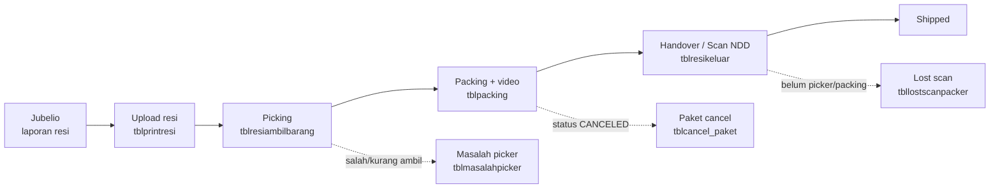
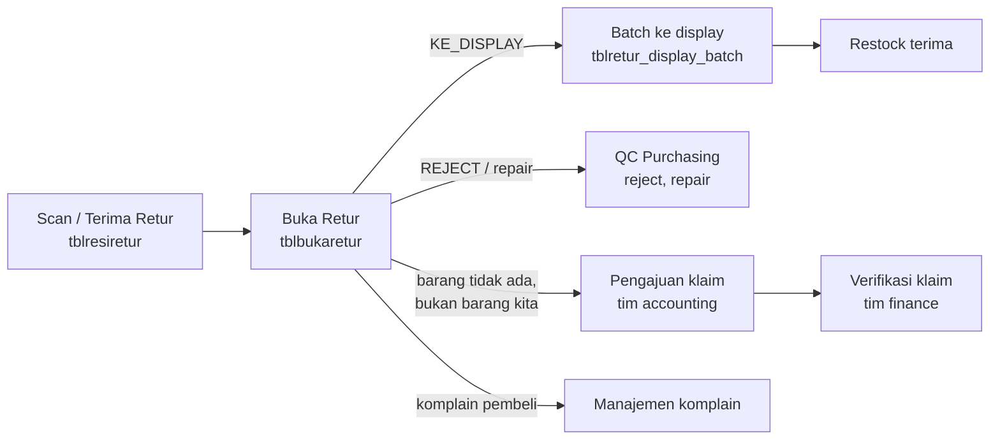
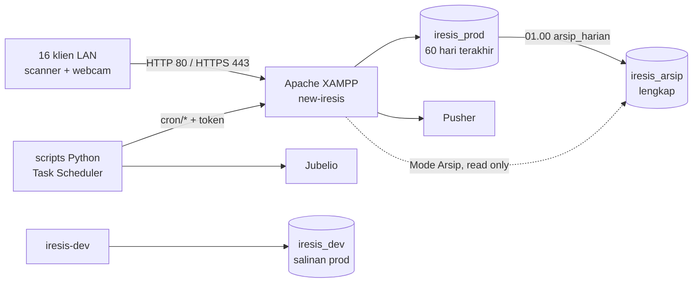

# PRD iResis — Sistem Operasional Gudang & Retur

Terakhir diperbarui: 23 Sep 2026

## 1. Ringkasan produk

iResis adalah sistem internal gudang BEVERRA yang mencatat setiap resi marketplace dari masuk sampai dikirim, dan setiap retur dari diterima sampai dibukukan. Semua langkah berbasis scan barcode, jadi setiap paket punya jejak siapa, kapan, dan di meja mana ia diproses.

**Masalah yang dipecahkan**

- Order dari marketplace (lewat Jubelio) tidak punya jejak fisik di gudang: tidak jelas paket sudah diambil, dikemas, atau diserahkan ke kurir.
- Paket yang lolos tanpa scan, salah ambil, atau kurang barang baru ketahuan setelah komplain pembeli.
- Retur menumpuk tanpa status: barang tidak kembali ke stok, dan klaim ke marketplace atau kurir terlambat.
- Kinerja picker dan packer tidak terukur, sehingga target harian dan insentif tidak punya dasar data.

**Bentuk produk saat ini**

Aplikasi web CodeIgniter 3 yang berjalan di satu PC server di jaringan lokal gudang, melayani 16 klien LAN. Aplikasi ini sudah live dan dikembangkan terus sejak Mei 2025, dengan 360 commit hingga 23 Sep 2026. PRD ini mendokumentasikan produk yang sudah berjalan, sebagai acuan untuk pengembangan berikutnya.

## 2. Tujuan & metrik keberhasilan

Tujuan utamanya: setiap resi yang masuk gudang harus keluar tepat waktu ke kurir yang benar, dengan barang yang benar, dan setiap penyimpangan tercatat di meja tempat ia ditemukan. Angka dasar di bawah diambil dari DB `iresis_dev` (salinan produksi) untuk 30 hari terakhir per 23 Sep 2026.

| Tujuan | Metrik | Kondisi saat ini |
| --- | --- | --- |
| Semua order tertangani tanpa antrean menumpuk | Resi masuk per hari vs resi keluar (handover) per hari | Masuk rata-rata 9.829/hari (puncak 15.432); keluar rata-rata 10.185/hari |
| Tidak ada paket lewat batas kirim kurir | % resi di-handover sebelum `jam_batas_kirim` kurir (13.00–16.00) | Belum diukur; batas jam sudah tersimpan per kurir |
| Kesalahan ambil barang turun | Laporan masalah picker (salah ambil, kurang, lebih) per hari | Rata-rata 36/hari (≈0,4% dari resi) |
| Tidak ada paket lolos tanpa scan | Jumlah lost scan packer dan lost scan picker | 1.048 lost scan packer sejak 8 Apr 2026; antrean lost scan picker 0 |
| Retur cepat kembali jadi stok | Resi retur per hari, dan umur retur di status "Terima Retur" | Rata-rata 352 retur/hari (puncak 1.619); 487 retur masih "Terima Retur" |
| Paket batal tidak ikut terkirim | Scan yang ditolak karena `CANCELED` | 41 penolakan tercatat sejak 21 Sep 2026 |
| Kinerja tim terukur | Resi per orang per hari vs `target_harian` per status performa | Target packer 40–80 per status sudah diisi; target picker masih 0 |

Metrik ketepatan waktu kirim dan umur retur belum punya laporan. Keduanya diusulkan sebagai pekerjaan pertama setelah PRD ini disepakati.

## 3. Pengguna & peran

Ada 11 peran (`tblhakakses`) dengan 89 akun aktif. Sebagian besar pengguna adalah operator lantai gudang yang bekerja di PC dengan scanner barcode, bukan pengguna kantor. Hak akses diatur per menu di tabel `roleaccess`. Menu yang dipegang tiap peran dihitung dari menu aktif per 23 Sep 2026.

| Peran | Akun aktif | Menu | Tugas utama di iResis |
| --- | --- | --- | --- |
| client orders | 43 | 19 | Operator lantai: scan picker, scan packer, scan resi keluar, input pengembalian, lapor lost scan |
| client packer | 12 | 21 | Scan packer (termasuk webcam + video), Salah Ambil Special, daftar masalah picker |
| client picker | 8 | 21 | Scan picker, update picker, scan retur, kirim ke display, monitoring speed |
| webmaster | 7 | 134 | Semua menu: master data, menu & akses, upload, seluruh laporan, Mode Arsip |
| tim retur | 7 | 83 | Scan/terima/buka retur, komplain, verifikasi retur, cek paket RTS, upload retur Jubelio |
| admin | 5 | 96 | Upload resi & SKU, master data, laporan produksi dan retur, klaim retur |
| ho | 3 | 28 | Serah terima ke kurir, Scan Paket NDD (lama & New), lost scan HO, laporan pengiriman |
| tim purchasing | 1 | 19 | QC pengembalian, repair, reject, giveaway, laporan barang tidak ada |
| tim inbound | 1 | 2 | Surat jalan kurangan picker dan riwayatnya |
| tim accounting | 0 | 14 | Surat jalan, verifikasi retur, klaim retur, pergantian barang |
| tim finance | 0 | 7 | Denda, pergantian barang, HPP, laporan control penjualan |

**Konteks pemakaian**

- Saat login, operator memilih nama PC (`nama_komputer`) dan status performa hari itu (misalnya GTL, NDD, 1_SKU). Keduanya dipakai untuk KPI.
- Layar scan harus bisa dipakai tanpa mouse: fokus otomatis ke kolom scan, bunyi berbeda untuk sukses, error, marketplace, dan kurir.
- Tim accounting dan finance belum punya akun aktif. Menunya ada, tetapi saat ini dijalankan oleh admin atau webmaster.

## 4. Alur bisnis inti

iResis punya dua jalur: jalur keluar (order ke kurir) dan jalur balik (retur ke stok atau klaim). Setiap tahap hanya bisa diproses kalau tahap sebelumnya sudah di-scan. Aturan ini yang membuat paket lolos tanpa scan bisa terdeteksi.

**Jalur keluar**

Garis putus-putus adalah jalur pengecualian. Lost scan dicatat di meja tempat paket ditemukan lalu dikembalikan ke tahap yang terlewat. Paket cancel ditolak di meja mana pun dan dicatat untuk dikembalikan ke display.

**Jalur balik (retur)**

Hasil buka retur menentukan cabangnya. Dari 23.936 baris buka retur di DB dev, 22.676 (95%) kembali ke display. Sisanya reject (367), barang tidak ada (343), bukan barang kita (261), bukan retur (191), dan alasan lain. Pengajuan klaim dan verifikasinya sengaja dipisah ke dua peran supaya pengaju bukan verifikator.

**Status resi**

| Status | Penanda di data | Meja |
| --- | --- | --- |
| Masuk | baris di `tblprintresi` | Admin (upload) |
| Sudah di-picker | baris di `tblresiambilbarang` | Picker |
| Sudah packing | baris di `tblpacking` + video | Packer |
| Keluar | baris di `tblresikeluar` / `tblscan_ndd` | HO |
| Batal | `status_pesanan = CANCELED` dari Jubelio | Semua meja menolak scan |
| Retur | baris di `tblresiretur` lalu `tblbukaretur` | Tim retur |

## 5. Kebutuhan fungsional per modul

Kebutuhan dikelompokkan mengikuti grup menu yang dilihat pengguna. Semua kebutuhan di bawah sudah live di produksi, kecuali yang ditandai **(rancangan)**. Kode F-xx dipakai sebagai rujukan di tiket dan commit berikutnya.

### 5.1 Resi masuk (Tim Resi)

| Kode | Kebutuhan | Menu / endpoint |
| --- | --- | --- |
| F-01 | Admin mengunggah laporan resi Jubelio (Excel). Resi unik per `noresi`; unggahan ulang memperbarui status, termasuk `CANCELED` | Upload Resi, `cron/auto_upload_resi` |
| F-02 | Unggahan resi berjalan otomatis dari script Python terjadwal, tanpa operator | `scripts/auto_upload_resi.py` |
| F-03 | Pengguna mencari resi dan melihat riwayat lengkapnya (picker, packer, HO, retur). Resi lama yang sudah diarsip ditarik balik otomatis | Detail Resi, Daftar Resi |
| F-04 | Admin mencetak ulang resi, menghapus resi salah unggah, dan mengecek paket RTS per rentang tanggal | Print Ulang Resi, Hapus Resi, Cek Paket RTS |
| F-05 | Master SKU diunggah dari Excel; foto produk tampil dari URL asli dengan cadangan salinan lokal | Upload SKU, Daftar SKU |

### 5.2 Picking (Tim Picker)

| Kode | Kebutuhan | Menu / endpoint |
| --- | --- | --- |
| F-10 | Picker men-scan resi. Sistem menolak resi yang tidak ada, batal, atau sudah di-picker, lalu mencatat picker, waktu, dan status performa | Scan Resi Picker |
| F-11 | Resi preorder punya jalur scan picker sendiri | Scan Picker PreOrder |
| F-12 | Satu scan bisa mencatat picker dan packer sekaligus untuk paket yang diproses satu orang | SCAN COMBINED |
| F-13 | Picker melaporkan barang kurang; laporan diteruskan ke surat jalan inbound | Kurangan Picker, SJ Kurangan Picker |
| F-14 | Admin melihat resi yang belum di-picker dan mengoreksi data picking | Resi Pending, Update Picker, Master Picker |

### 5.3 Packing (Tim Packer)

| Kode | Kebutuhan | Menu / endpoint |
| --- | --- | --- |
| F-20 | Packer men-scan resi. Sistem menolak resi yang belum di-picker, batal, atau sudah packing, lalu menampilkan item yang harus dikemas | Scan Resi Packer |
| F-21 | Packing lewat webcam merekam video per resi (maks. 90 menit), disimpan di luar document root, lalu difinalisasi ffmpeg | Scan Resi Packer (Webcam), `cron/finalisasi_video` |
| F-22 | CS memutar video packing per resi untuk menjawab komplain pembeli | Video Packing |
| F-23 | Packer melaporkan salah ambil, kurang, atau lebih ambil dari picker | Modal Masalah Picker |
| F-24 | Packer melaporkan sekumpulan resi 1 SKU / 1 qty yang salah ambil dengan scan berantai dan 7 validasi | Salah Ambil Special |
| F-25 | Supervisor memantau kecepatan packer secara realtime | Monitoring Speed, Laporan Speed |

### 5.4 Serah terima ke kurir (Tim HO)

| Kode | Kebutuhan | Menu / endpoint |
| --- | --- | --- |
| F-30 | HO men-scan paket keluar. Sistem menolak paket yang belum di-picker, belum packing, atau batal | Scan Resi Keluar, Scan Paket NDD |
| F-31 | Saat paket ditolak karena belum packing / belum picker, HO memilih packer dan mencatat lost scan di layar yang sama | Scan Paket NDD New |
| F-32 | Laporan paket NDD dan pengiriman per kurir, termasuk sisa resi yang belum dikirim | Laporan Paket NDD, Pengiriman, Sisa Resi Belum Kirim |

### 5.5 Pengecualian lintas meja

| Kode | Kebutuhan | Menu / endpoint |
| --- | --- | --- |
| F-40 | Paket yang ditemukan belum di-picker masuk antrean tim picker. "Tambahkan Picker" membuat baris picking tanpa KPI, lalu packer dan HO scan ulang. Halaman segar sendiri tiap 30 detik | Laporan Lost Scan Picker |
| F-41 | Semua lost scan packer/picker/HO bisa dicatat dan dilaporkan per orang dan per tanggal | Lost Scan Packer/Picker, Lost Scan HO, Laporan Lost Scan |
| F-42 | CS memproses semua masalah picker yang pending sekaligus dan mencetak slip per picker, urut rak lantai 1-2-3, dengan riwayat cetak ulang | Daftar Masalah Picker New |
| F-43 | Setiap scan yang ditolak karena `CANCELED` dicatat di 7 titik penolakan (siapa, meja, jam) dan tampil di Laporan Resi Cancel | `Cancel_paket_fcd::catat_tolak()` |
| F-44 | **(rancangan)** Tim retur mengecek isi paket cancel, selisihnya jadi masalah picker, lalu barang dikirim ke display lewat batch restock | [`PAKET_CANCEL.md`](PAKET_CANCEL.md) tahap 2–3 |
| F-45 | Admin mencatat order batal dari admin toko dan mengecek order batal dengan scan | Daftar Cancel Order, Scan Cek Cancel |

### 5.6 Retur & komplain (Tim Retur, Tim CS)

| Kode | Kebutuhan | Menu / endpoint |
| --- | --- | --- |
| F-50 | Tim retur men-scan paket retur yang datang dan mencocokkannya ke resi asal (termasuk resi yang sudah diarsip) | Scan Retur |
| F-51 | Buka retur mencatat SKU, qty, dan hasilnya (ke display, reject, barang tidak ada, bukan barang kita, bukan retur, dll.) | Update Retur, Cek SKU Retur |
| F-52 | Laporan retur Jubelio diunggah manual atau otomatis, lalu diverifikasi terhadap retur fisik | Upload Retur Jubelio, Verifikasi Retur |
| F-53 | Retur komplain punya jalur scan, update, dan verifikasi sendiri; CS memproses refund atau penggantian | Scan/Update Retur Komplain, Manajemen Komplain |
| F-54 | Dashboard retur menampilkan volume dan status retur harian | Dashboard Retur |

### 5.7 QC, purchasing & restock

| Kode | Kebutuhan | Menu / endpoint |
| --- | --- | --- |
| F-60 | Barang retur layak jual dikirim ke display dalam batch (DIKIRIM → DITERIMA oleh tim restock) | Kirim ke Display, Laporan Retur Display |
| F-61 | Packer menginput pengembalian barang; tim restock menyetujui satu per satu atau sekaligus | Input Pengembalian, Approval Pengembalian |
| F-62 | Purchasing memproses QC, repair, reject, dan giveaway beserta laporannya | Pengembalian QC, Repair, Reject, Giveaway |
| F-63 | Laporan stok terkini dan stok hasil retur | Laporan Stock, Stock Terupdate |

### 5.8 Accounting & finance

| Kode | Kebutuhan | Menu / endpoint |
| --- | --- | --- |
| F-70 | Accounting mengunggah dan mencari surat jalan, termasuk surat jalan kurangan picker | Surat Jalan, Surat Jalan Database |
| F-71 | Accounting mengajukan klaim retur ke kurir/marketplace dari kandidat yang dihitung live; finance memverifikasi pergantian yang benar-benar diterima | Pengajuan Klaim Retur, Verifikasi Klaim Retur |
| F-72 | Finance mencatat denda dan pergantian barang | Denda, Pergantian Barang |
| F-73 | Finance mengunggah HPP dan melihat laporan control penjualan | Upload HPP, Laporan Control Penjualan |
| F-74 | Pembatalan oleh admin toko Shopee dicatat untuk memantau penalti | Shopee Penalty (dashboard, input, laporan terpadu) |

### 5.9 Monitoring, laporan & KPI

| Kode | Kebutuhan | Menu / endpoint |
| --- | --- | --- |
| F-80 | Supervisor melihat selisih paket hari ini, paket mendekati batas kirim, dan paket yang masih diproses | SELISIH HARI INI, Batas Kirim Paket, Paket On Progress |
| F-81 | Totalan picker dan packer tampil realtime; ekspedisi yang urgent disorot | Totalan Picker/Packer (Realtime), Ekspedisi Urgent |
| F-82 | Target harian diatur per pegawai dan per status performa; pencapaian direkap harian | Kelola Target Pegawai, Target KPI, Pencapaian Target Harian |
| F-83 | Dashboard KPI picker dan packer, plus rekap kesalahan picker & packer | Dashboard Kpi Picker/Packer, Rekap Kesalahan |
| F-84 | Laporan resi (dalam proses, harian, per hari, dikirim, preorder, SKU special, cancel) bisa diekspor ke Excel | Grup menu Laporan |

### 5.10 Administrasi & data lama

| Kode | Kebutuhan | Menu / endpoint |
| --- | --- | --- |
| F-90 | Webmaster mengelola user, menu, dan hak akses per peran. User dinonaktifkan, tidak dihapus | User, Menu, Access |
| F-91 | Master kurir (dengan jam batas kirim), marketplace, pegawai, dan SKU special | Grup menu Master |
| F-92 | Data lama dipindah tiap malam ke DB `iresis_arsip`. Pengguna bisa masuk Mode Arsip (hanya baca) untuk melihatnya | Mode Arsip, `cron/arsip_harian` |

## 6. Kebutuhan non-fungsional

Kebutuhan terpenting: layar scan tidak boleh lambat atau rusak saat puncak ~15 ribu resi per hari, karena satu scan yang macet menahan satu meja kerja.

| Aspek | Kebutuhan | Cara dipenuhi saat ini |
| --- | --- | --- |
| Kinerja scan | Endpoint scan menjawab tanpa kerja tambahan per request | Migrasi dan pembuatan menu hanya jalan sekali per versi (`BOOTSTRAP_VERSI`); dulu ~98 query + DDL (228 ms) di setiap request |
| Volume | Menangani puncak 15.432 resi/hari dan 1.619 retur/hari | Prod hanya menyimpan keluarga resi 60 hari terakhir (±0,7 GB); sisanya di arsip |
| Operasi berat | Upload SKU dan ekspor massal tidak putus di tengah | `memory_limit 3072M`, `set_time_limit(0)`, timeout AJAX 600.000 ms, progress tampil di layar |
| Keandalan respons | Satu byte keluaran nyasar tidak boleh merusak halaman | Semua respons AJAX lewat `make_ajax_response()`: buffer dibersihkan, selalu HTTP 200, status di body JSON |
| Integritas data | Operasi krusial tidak setengah jadi | `trans_start()`/`trans_complete()`; `db_debug` dimatikan sementara agar error tidak mencetak HTML |
| Jalan tanpa internet | Aplikasi tetap bisa dipakai saat koneksi keluar putus | Semua aset pihak ketiga lokal (dilarang CDN); foto produk punya salinan lokal di `C:\foto-produk\` |
| Webcam | Rekaman packing jalan dari klien LAN | HTTPS port 443 di LAN; video disimpan di luar document root |
| Keamanan akses | File sensitif tidak bisa diunduh dari LAN | `.htaccess` whitelist: hanya `index.php`, `assets/`, `favicon.ico`; kredensial di `secrets.php` (gitignored); endpoint cron butuh token |
| Keamanan data | SQL manual tidak menghapus data | Dilarang `DELETE`/`DROP`/`TRUNCATE`; `UPDATE` massal wajib backup dulu. Satu-satunya penghapusan adalah Purna arsip, dengan verifikasi PK dan gerbang backup ≤ 36 jam |
| Mode Arsip | Melihat data lama tidak boleh mengubah prod | Session diarahkan ke `iresis_arsip` dengan `SET SESSION TRANSACTION READ ONLY` |
| Bahasa | UI, pesan error, dan dokumen berbahasa Indonesia | Standar proyek |
| Kompatibilitas | Berjalan di PHP 8.2 walau kode ditulis untuk 7.4 | Tambalan kompatibilitas (commit `e48446d`), `MY_Output` mencegah *Deprecated* PHP 8.1+ |

**Jadwal otomatis (Task Scheduler)**

| Jam | Tugas |
| --- | --- |
| Tiap menit | `finalisasi_video`: remux WebM, konversi MP4 atas permintaan CS |
| 22.30 tgl 1 | `optimasi_tabel`: mengembalikan ruang disk |
| 23.00 | `sinkron_foto_sku`: salin foto produk ke folder lokal |
| 01.00 | `arsip_harian`: salin prod ke `iresis_arsip`, lalu Purna memindahkan resi > 60 hari |
| 02.30 | Backup DB arsip |

## 7. Integrasi eksternal & otomasi

Jubelio adalah satu-satunya sumber order dan retur. Semua data masuk lewat script Python terjadwal yang mengirim ke endpoint `cron/*` ber-token, bukan lewat integrasi langsung dari PHP.

| Integrasi | Arah | Jalur | Frekuensi | Catatan |
| --- | --- | --- | --- | --- |
| Jubelio — resi (v1) | Masuk | Chrome/DrissionPage unduh laporan Faktur + Pesanan (.xlsx) → `cron/auto_upload_resi` | Harian | Jalur lama, disimpan sebagai cadangan |
| Jubelio — resi (v2) | Masuk | `core-api` Jubelio langsung, tanpa browser → `cron/auto_upload_resi_api` | Harian | Resi yang statusnya tidak berubah dilewati lewat `cron/check_resi_status`; retry untuk HTTP 429 |
| Jubelio — retur | Masuk | Browser automation unduh laporan retur → `cron/auto_upload_retur_jubelio` | Harian, contoh 08.30 | Laporan dibuat Telerik Report Server, hanya bisa dipicu dari tombol "Cetak" |
| Pusher | Keluar | `Notification::send()` → `Pusher_lib` | Saat kejadian | Notifikasi realtime ke tim (finance, purchasing, accounting, inbound, packer, dll.) |
| ffmpeg | Lokal | `Cron::finalisasi_video` | Tiap menit | Tanpa ffmpeg, rekaman tetap bisa diputar |
| Foto produk | Masuk | URL asli di `tblsku`, cadangan salinan lokal lewat Apache `Alias /foto-produk/` | Harian 23.00 | Browser coba URL asli dulu, lalu lokal |

Rincian jalur Jubelio ada di [`AUTO_UPLOAD_RESI.md`](AUTO_UPLOAD_RESI.md) dan [`AUTO_UPLOAD_RETUR_JUBELIO.md`](AUTO_UPLOAD_RETUR_JUBELIO.md).

**Kebutuhan integrasi**

- Endpoint `cron/*` wajib menolak request HTTP tanpa `?token=` yang cocok; pemanggilan CLI bebas token.
- Kredensial Jubelio dan token cron hanya ada di file yang di-gitignore (`secrets.php`, `scripts/secrets_local.py`, `scripts/jubelio_credentials.py`).
- Unggah ulang data yang sama tidak boleh menggandakan resi atau retur (upsert per `noresi`).
- WhatsApp gateway dan ngrok sudah dihapus (17 Sep 2026) dan tidak termasuk kebutuhan.

## 8. Arsitektur & data

iResis adalah monolit CodeIgniter 3 di satu PC server Windows (XAMPP), dengan tiga database MariaDB: produksi, arsip, dan dev. Per 23 Sep 2026 kodenya terdiri dari 44 controller, 47 model, 413 route eksplisit, dan 84 tabel di DB dev.

Folder `iresis-dev` dan DB `iresis_dev` terpisah total dari produksi (user MariaDB sendiri tanpa akses ke `iresis_prod`). Perubahan dikerjakan di dev, di-merge ke `master`, di-push, lalu di-`git pull` di folder produksi. Lihat [`LINGKUNGAN_DEV.md`](LINGKUNGAN_DEV.md) dan [`PANDUAN_PULL_PRODUKSI.md`](PANDUAN_PULL_PRODUKSI.md).

**Pola teknis yang wajib diikuti**

- **SPA semu lewat AJAX.** Navigasi menu tidak reload halaman: `plugins.js` mengambil view sebagai JSON `{"view": "<html>"}` lalu menaruhnya di `.page-content-wrap`.
- **DataTables server-side** membalas array string HTML yang sudah dirender di PHP, termasuk tombol aksi.
- **Migrasi di kode.** DDL, menu baru, dan hak akses dijalankan `MY_Controller::jalankan_bootstrap_sekali()`. Setiap menu atau migrasi baru wajib menaikkan `BOOTSTRAP_VERSI`.
- **Model per domain** bersuffix `_fcd`. Controller terbesar (`Retur.php` 3.092 baris, `Report.php` 2.628, `Cs.php` 2.494) berbagi tabel retur yang sama.

**Tabel inti**

| Area | Tabel |
| --- | --- |
| Resi | `tblprintresi`, `tbldetailprintresi` |
| Picking | `tblresiambilbarang`, `tbllostscanpicker_pending` |
| Packing | `tblpacking`, `tblpacker_performance_logs` |
| Handover | `tblresikeluar`, `tblscan_ndd`, `tbllostscanpacker` |
| Masalah & cancel | `tblmasalahpicker`, `tblmasalahpicker_proses(_item)`, `tblkurangan_picker`, `tblcancel_paket(_tolak)` |
| Retur | `tblresiretur`, `tblbukaretur`, `tblretur_komplain`, `tblreturklaim` |
| Restock & QC | `tblretur_display_batch(_detail)`, `tblpengembalian_qc`, `tblpurchasing_reject`, `tblpurchasing_repair` |
| KPI | `tblkpi`, `tblmasterstatusperforma`, `tblstatusperforma`, `tbltargetkpiharian` |
| Master & akses | `tblsku`, `tblkurir`, `tblmarketplace`, `tbluser`, `tblhakakses`, `menu`, `roleaccess` |

Skema lengkap ada di [`DATABASE_STRUCTURE.md`](DATABASE_STRUCTURE.md).

## 9. Di luar lingkup

iResis mengurus pergerakan fisik paket di satu gudang. Hal-hal berikut sengaja tidak ditangani:

- **Pengelolaan order dan stok utama.** Order, harga, dan stok tetap dikelola di Jubelio; iResis menyimpan salinan untuk proses gudang.
- **Integrasi langsung ke marketplace.** Shopee, Tokopedia, Lazada, TikTok, dan lainnya hanya lewat Jubelio.
- **Akses dari luar LAN dan aplikasi mobile.** Semua klien adalah PC di jaringan gudang.
- **Multi-gudang atau multi-perusahaan.** Satu instalasi melayani satu gudang BEVERRA.
- **Penghapusan data oleh pengguna.** User dan data lain dinonaktifkan atau diarsip; penghapusan fisik hanya lewat Purna arsip.
- **Notifikasi WhatsApp.** Gateway WA dan ngrok sudah dihapus 17 Sep 2026.
- **Migrasi framework** (misalnya ke CodeIgniter 4). Tidak direncanakan dalam PRD ini.

## 10. Risiko, asumsi & pertanyaan terbuka

Risiko terbesar adalah satu PC server dengan satu disk: server, DB produksi, arsip, dan semua backup berada di drive C: yang sama.

**Risiko yang sudah diketahui**

| Risiko | Dampak | Mitigasi saat ini / usulan |
| --- | --- | --- |
| Satu server, satu disk | Kerusakan disk menghentikan 16 meja dan menghapus backup sekaligus | Backup prod tiap 30 menit (07–22) dan arsip harian 02.30, tapi masih di disk yang sama. Usulan: pindahkan backup ke drive atau mesin lain |
| Password MD5 tanpa salt | Password mudah dipecahkan bila tabel `tbluser` bocor | Usulan: migrasi ke `password_hash()` saat login berikutnya |
| CSRF dan XSS filter mati | Aksi bisa dipicu dari halaman lain di LAN | Hanya LAN; usulan: aktifkan bertahap per modul |
| Hak akses dicek manual per controller | Endpoint bisa dipanggil peran yang tidak punya menunya | `MY_Controller::validate()` praktis no-op; `Retur_klaim` sudah menjaga endpoint sendiri. Usulan: jadikan pola umum |
| Ketergantungan pada UI Jubelio | Perubahan layar atau laporan Jubelio menghentikan unggah otomatis | Jalur API v2 untuk resi; v1 browser sebagai cadangan |
| Tanpa test otomatis | Regresi baru ketahuan di lantai gudang | Syntax check + uji manual di `iresis-dev` sebelum pull ke produksi |
| Data tanggal rusak | 61.033 resi punya `tanggal_printresi = 0000-00-00` (Mar 2026) | Perbaikan butuh `UPDATE` prod dengan konfirmasi 3× + backup; belum dikerjakan |

**Asumsi**

- Angka volume dan jumlah akun diambil dari `iresis_dev`, salinan produksi per 23 Sep 2026.
- Semua pengguna bekerja di LAN gudang dan server menyala 24 jam.
- Jubelio tetap menjadi satu-satunya sumber order dan retur.

**Pertanyaan terbuka**

- [ ] Berapa target % paket yang di-handover sebelum jam batas kirim kurir?
- [ ] Berapa target harian picker? Nilainya di `tblmasterstatusperforma` masih 0.
- [ ] Berapa lama retur boleh berada di status "Terima Retur" sebelum dianggap terlambat?
- [ ] Jalur unggah resi mana yang aktif di produksi: v1 (browser) atau v2 (API)?
- [ ] Siapa pemilik menu tim accounting dan finance, yang belum punya akun aktif?
- [ ] Kapan tahap 2–3 alur paket cancel (cek isi, kirim ke display) dijadwalkan?
